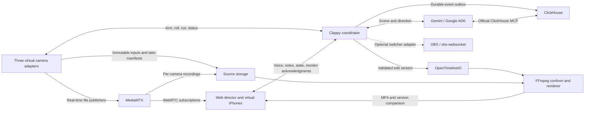

# Clappy implementation plan — revision 2

Updated September 7, 2026 after the user's OSS recommendations and demo clarification. Product foundation: [VISION.md](VISION.md). Technical assessment: [OSS_ASSESSMENT.md](docs/OSS_ASSESSMENT.md). Execution evidence: [BUILD_STATUS.md](docs/BUILD_STATUS.md).

## 1. Current scope and authority

Build the complete Clappy loop: **load a scene → arm three cameras → roll by voice → follow the performance → obey a live instruction → cut → replay → create a different edit from the same sources.**

The user has now specified:

- A new, separate Google Cloud project.
- iPhone as the only intended phone platform; no Android work.
- A visual demo with virtual phones, without a required physical-device shoot.
- Consider established OSS to reduce custom media infrastructure.
- This Codex performs development. The user reports organizer confirmation that this is permitted; the submitted AI engine uses Google Cloud AI only.

These directions supersede the physical-demo requirement in `VISION.md` and version 1 of the plan. Preserve the larger product ambition while accurately labeling what the demonstration proves. A web-rendered virtual iPhone is not an Apple Simulator run or a tested native application.

The demo is still a functioning system: three independently controllable publishers, actual video transport and recording, real Gemini decisions, real ClickHouse MCP queries, and rendered alternate edits. A recorded scene supplies the performance; it does not supply a prerecorded agent response or fixed switching sequence.

## 2. Decisions

| Area | Decision | Reason |
| --- | --- | --- |
| Realtime media hub | Adopt MediaMTX | Reuse publishing, subscription, per-path recording, playback and health APIs |
| Media tools | Keep FFmpeg/ffprobe | Simulate cameras, create compatible derivatives, inspect and render footage |
| Editorial interchange | Adopt OpenTimelineIO at the edit boundary | Standard timelines with media references and rational frame times |
| Program monitor | Browser view of three preconnected streams | First release needs straight camera selection and a recorded decision list |
| Professional mixer | OBS + obs-websocket optional adapter | Useful for encoded live output or demo capture; not a hosted-app dependency |
| Phone implementation | Virtual iPhone camera adapters first | Automatable and repeatable, without physical capture or signing dependency |
| Native iPhone path | Evaluate HaishinKit + AVFoundation later | Native streaming candidate; local recording and timing still need proof |
| Alternative media platform | LiveKit as a fallback, not a second hub | SDK-driven WebRTC alternative if MediaMTX's browser integration fails its spike |
| Mobile cross-platform stack | Defer VisionCamera/react-native-webrtc | No Android requirement or native mobile delivery gate for this demo |
| Full NLE engine | Defer MLT | Straight cuts and continuous master audio do not require a full editor engine |

MediaMTX supports the required stream protocols and recordings, but is not a synchronizer, editorial engine, or automatic transcoder. [Publishing](https://mediamtx.org/docs/features/publish), [recording](https://mediamtx.org/docs/features/record), [re-encoding](https://mediamtx.org/docs/features/remuxing-reencoding-compression)

## 3. Revised architecture



Keep React/Vite/TypeScript, FastAPI/Pydantic, SQLite/WAL for one coordinator's transactional state/outbox, Google ADK and Google Gen AI SDK, ClickHouse with its official MCP server, and Google Cloud Storage for durable media.

Replace custom peer-to-peer phone/director signaling and director-browser proxy recording with MediaMTX subscriptions and centralized per-camera recordings. Use the project's publisher/reader helpers where applicable rather than implementing WHIP/WHEP signaling from scratch. [Browser publishing](https://mediamtx.org/docs/publish/web-browsers), [browser playback](https://mediamtx.org/docs/read/web-browsers)

Deploy the initial app, coordinator, MediaMTX, and bounded workers on one Google Compute Engine VM with persistent disk and HTTPS. Keep administrative endpoints private. WebRTC requires reachable media ports in addition to HTTPS; verify the advertised host and connectivity from outside the VM. Use authenticated TURN where needed. Pin a tested MediaMTX release and its configuration schema.

Google Cloud project **`clappy-cinema-2026-0907`**, display name **Clappy Cinema**, was created and verified ACTIVE on September 7. Project number: `132530031832`. The user explicitly approved linking the open Official Billing Account; billing is now verified enabled. Vertex AI, Speech and Storage APIs are enabled. A real `gemini-2.5-flash` request succeeded using the global endpoint and authorized gcloud identity. Local ADC was expired, so development explicitly selects `CLAPPY_AUTH_MODE=gcloud`. The dedicated hosted VM now uses an attached service account / ADC, trusted HTTPS, private control ports and bounded usage. See [hosting and recovery](docs/HOSTING.md) for its 24-hour automatic stop and retained-disk cost. The existing default gcloud project was not changed. Always select Clappy's project and quota project explicitly.

## 4. What a virtual camera actually does

Define a `CameraAdapter` interface with identity, role, capabilities, prepare/start/stop, health, media-clock mapping, source manifest, and recording verification. The simulation and future iOS adapter implement the same production semantics.

The first adapter is a supervised FFmpeg publisher using one synchronized source file per camera. Use RTSP/TCP from the local worker into MediaMTX for the initial spike; browsers consume WebRTC. SRT is a later native-network option, not a requirement for processes on the same host.

Each camera has its own process, source, session/take path, acknowledgment state, and failure controls. The UI renders those states in three iPhone-shaped camera views: Tom close-up, Bella close-up, and wide. A small “Virtual camera” label identifies the source. The camera screens are part of the real application, not a separate animation.

Prepare source decoders before the take; establish a common source-media origin or explicit pre-roll boundary for ROLL. Measure actual first frames instead of treating process launch times as capture timestamps. Preview behavior before roll and take-relative source mapping must be demonstrated in the first spike.

Use two fixture classes:

1. Tiny generated frame-counter clips with shared click tracks and known timing offsets for correctness tests.
2. A coherent 60–90 second two-character scene with an emotional reveal for the product demo. All three views must correspond to the same performance and timeline. Use owned or appropriately licensed material, or a documented synthetic scene. If close-ups are crops of a wide shot, label them as derived views; do not claim independent camera angles.

Keep immutable fixture originals, per-take source ranges, hashes, and MediaMTX recordings. A network copy is not a substitute for a future iPhone's local original. Configure recording retention explicitly; disable automatic deletion of take media until an intentional retention policy exists. Index finalized segments and detect incomplete tails.

## 5. Media compatibility and synchronization

Normalize preview derivatives once where possible: initially H.264 without B-frames and Opus audio, with actual Safari/WebKit playback verified. Native SRT/RTMP ingestion may bring different audio codecs and require a separate FFmpeg preview conversion. MediaMTX protocol routing alone does not solve that. [WebRTC codec and connectivity constraints](https://mediamtx.org/docs/features/webrtc-specific-features)

Keep one continuous master audio source. Mute other camera playback audio to avoid echo. Decouple production audio sent to Google transcription from the director microphone used for commands.

Store monotonic session time, device/publisher time, encoded media time, and receive time separately. The transform is versioned: `session_time = offset + scale × source_media_time`. Record uncertainty and a timeline epoch, so a restart cannot silently reuse a different monotonic origin.

Virtual cameras provide known fixture mappings, but verify received recordings using frame counters and audio correlation. Inject delayed starts, dropped connections, and drift. Future real iPhones will require clap/waveform alignment and measured native timestamps; simulator alignment does not prove hardware synchronization.

The browser monitor prioritizes responsiveness and is not frame-locked. Keep all three subscriptions active and switch visibility without reconnecting. Record decision acceptance and client application separately; if a stream freezes, mark it stale and fall back to a healthy source. This is an on-screen program monitor. Encoded live broadcast output belongs to the optional OBS adapter; final MP4 output belongs to FFmpeg.

## 6. Production state and commands

Take lifecycle: `DRAFT → ARMING → ARMED → STARTING → RECORDING → STOPPING → FINALIZING → READY`, with explicit partial/interrupted states. Camera lifecycle distinguishes connected, prepared, recording, finalized, and verified media; stream availability alone does not imply recording success.

Every command carries `command_id`, session/take IDs, expected state revision, expiry, kind, and typed payload. Persist accepted/applied/failed outcomes. Retries use the same ID. Reject stale-take or stale-revision AI actions. Deduplication and mutation/outbox writes occur transactionally.

ARM checks publishers, source ranges, writable storage, and media subscriptions. ROLL schedules a shared target after required preparation acknowledgments. Start failure is a partial take, not an atomic-start claim. CUT stops publishers or closes the defined recording ranges, waits for segment finalization, and verifies decodability. Use a local maximum take length and a visible stop control.

The coordinator owns production commands and edit decisions. MediaMTX owns media paths and recording. Translate the hub's API/hook observations into Clappy events; a recording hook cannot invent creative intent. Authenticate path access by session and camera role. [MediaMTX control API](https://mediamtx.org/docs/features/control-api)

Manual roll, cut, and hold use the same execution path as voice and never wait for a model. Reconnection reconciles actual process and recording state before issuing another start. Worker restart preserves existing sources and marks interrupted takes truthfully.

## 7. Gemini and the directing engine

Parse a text/Fountain scene into ordered dialogue and character cues. Gemini produces a validated scene interpretation: emotional beats, likely reaction moments, camera coverage, and a directing policy. The filmmaker can correct the script or roles before arming.

Use Google Cloud streaming Speech-to-Text for performance transcription and bounded fuzzy alignment against nearby script lines. Speaker identity comes primarily from script alignment and camera roles, not assumed voice recognition. Repeats, skipped lines, ambiguous dialogue, and overlap lower confidence. Keep supplied fixture transcripts as evaluation ground truth; the live demo must actually process performance audio.

At beat changes and new notes, Gemini can query production history and propose a new direction. Between model responses, deterministic software enforces minimum shot lengths, camera health, queued conditions, and current policy. Limit concurrency and reject expired proposals. No per-frame LLM calls.

Director voice uses a separate Gemini Live session, headset/microphone selector, and optional push-to-talk. If Live tool integration is unstable, use Google transcription plus ADK intent handling on that same dedicated channel. Do not use browser speech services with unknown providers. Performance input cannot invoke production-control tools.

Required commands: roll, cut, go wide, hold this shot, stay on Bella, go wide after Tom's next line, release hold, replay, and create a Bella-focused version. Delayed direction becomes a queued condition bound after command acceptance; it expires at take end and displays whether it is waiting, applied, or unresolvable.

Priority: emergency/manual stop → director override → queued instruction → agent policy → healthy-camera fallback. Default minimum hold is around 2.5 seconds. Low-confidence tracking should settle on a useful shot rather than oscillate.

Keep a small tool surface and compact visible explanations. Preserve model ID, input state revision, instruction, memory evidence, accepted decision and applied action. Pin tested Google Cloud model IDs after authenticated smoke tests. No non-Google model or agent framework powers the runtime.

## 8. ClickHouse remains structurally important

Append production events to a transactional SQLite outbox and batch into ClickHouse. Delivery is at least once: use immutable event IDs and explicit query deduplication. Store session sequence, source sequence, occurrence/receipt times, confidence, command/decision links, and schema version. Publish an ingestion watermark so the agent knows what history is complete.

Use official `mcp-clickhouse` through ADK's MCP toolset with a server-side read-only role and session-constrained views. Coordinator ingestion uses a normal database client. Discover and pin the actual MCP schema instead of guessing tool names.

Required memory-dependent behaviors:

- Before a meaningful live decision, consult camera assignment and recent shot/character coverage; combine the persisted watermark with an identified pending-event tail.
- After restarting the agent, reconstruct what happened in a take from production events.
- Before making an alternate edit, query available footage, beat positions, prior edit allocation, and director notes through MCP.

Capture real MCP requests/results and reference them in decisions. With ClickHouse disabled, recording and manual controls continue, while recall and memory-backed redirection become unavailable. Do not substitute a mock or canned answer while claiming live production memory.

## 9. OpenTimelineIO and final rendering

Keep the Clappy command/event schemas: OTIO is an editorial interchange format, not the protocol for a recording command or AI instruction. At take finalization, validate a normalized cut list and construct an OTIO timeline with referenced camera clips, rational frame times, continuous master audio, markers, and metadata. [OTIO overview](https://opentimelineio.readthedocs.io/en/latest/)

The edit-version record carries ID, parent, take, source-manifest hash, sync revision, policy, and OTIO artifact hash. The web API returns a projection of that same timeline. Never maintain unrelated JSON and OTIO timelines that can disagree.

Implement and test a small OTIO-to-FFmpeg compiler for the supported subset: sequential straight picture cuts and one master audio track. OTIO does not make FFmpeg understand a timeline automatically. Reject unsupported transitions/effects until implemented. Re-encode where needed for frame-accurate cuts; do not assume keyframe-only stream copies suffice.

Validate media availability, positive durations, complete intended coverage, no accidental overlaps/gaps, and correct source offsets. Keep original files and parent edits immutable. Output MP4, `.otio`, and a source manifest. Round-trip the OTIO artifact and verify frame ranges and media references survive.

After CUT, the decision timeline is available immediately. Playable review follows recording finalization and alignment; show processing state. Render high-quality versions asynchronously with bounded concurrency. A/B playback uses the same scene time, and character screen-time statistics demonstrate a note's effect.

## 10. OBS and future iPhone capture

An optional `SwitcherAdapter` can translate committed selection into OBS scene changes and capture applied acknowledgments. Protect obs-websocket and maintain three warm sources with one master audio bed. OBS includes WebSocket control in modern versions. [obs-websocket](https://github.com/obsproject/obs-websocket)

Add this only if an encoded live program or composited demo output materially helps. OBS setup, ingestion, monitoring, and runtime availability would otherwise become extra requirements for judges. The browser workflow must remain usable without desktop OBS. Do not add both OBS switching and a second bespoke live encoder.

For native iPhone production, HaishinKit is a credible streaming candidate with AVFoundation for capture/local recording as required. Spike one capture session feeding independent full-quality local output and a network derivative. Do not assume combining capture libraries yields simultaneous access or matching timestamps. Current HaishinKit releases have explicit Xcode/Swift requirements; no native delivery is claimed until those and device tests are met. [HaishinKit](https://github.com/HaishinKit/HaishinKit.swift)

## 11. Product surfaces and files

Setup: scene, character mapping, camera assignments, source selection, readiness and audio channels. Shoot: prominent program view, three virtual iPhones, live script position, current direction, and persistent stop button. Review: takes, compact timeline, original/source status, A/B versions, redirection and exports.

Use a quiet dark visual system, legible typography, stable camera colors, and red for recording. Keep infrastructure details behind a “Why this cut?” or evidence drawer. The virtual-phone presentation is explicit, but does not overwhelm the filmmaking interaction.

```text
apps/web/                   Setup, shoot, review, virtual iPhone views
services/api/               State, command API, WebSocket updates
services/api/agent/         Google ADK, Gemini/Live and speech integration
services/api/memory/        Outbox, ClickHouse, official MCP integration
services/cameras/          CameraAdapter and FFmpeg virtual publishers
services/media/            MediaMTX API, recording index, health and access
services/worker/           Alignment, OTIO compiler, FFmpeg rendering
packages/contracts/       Schema source and generated TS bindings
db/                       SQLite and ClickHouse migrations
tests/fixtures/            Synchronized media and test screenplay
tests/integration/         Protocol, media, memory and editing scenarios
infra/                    MediaMTX/configuration, containers, GCP deployment
docs/                     Build evidence, runbook, OSS notices and demo
```

Pin dependencies/containers after the first successful spike. Record licenses and provenance for the exact versions/assets used. Reuse OSS components without representing their code as Clappy's invention. Star counts are not a selection or acceptance criterion.

## 12. Revised milestone order

The deadline remains September 9, 2026 at 5 p.m. Eastern. Target feature freeze that morning and a complete submission package by 2 p.m. Preserve time for the visual demo and deployed validation; budgets below total about 33 focused implementation hours and are targets, not guarantees.

| Milestone | Budget | Exit evidence |
| --- | --- | --- |
| M0: OSS media spike | 3h | Three FFmpeg publishers → MediaMTX → browser; valid separate recordings; known timestamps; WebKit codec behavior |
| M1: production control | 4h | Arm/roll/cut, per-camera acknowledgment, reconnect/failure, durable events and source manifests |
| M2: manual edit loop | 4h | Program selection → validated OTIO → correct MP4, continuous audio and preserved sources |
| M3: AI director | 7h | Actual Google speech input, scene following, Gemini policies, voice instruction and a held reaction; real MCP evidence |
| M4: memory and redirection | 5h | Agent restart/recall, coverage queries, immutable alternate version, A/B playback and OTIO export |
| M5: product and deployment | 5h | Virtual-phone experience, external hosted smoke test, scoped credentials, recovery and bounded resource use |
| M6: visual demo and delivery | 5h | Honest sub-three-minute demo, README/license/notices, reproducible setup, hosted judge flow and submission materials |

Cloud billing and runtime API access can be resolved alongside local work. No physical shoot, App Store signing, Android compatibility, or Apple Simulator is a gate. Native capture stays a future milestone, not hidden unfinished demo scope.

If MediaMTX fails browser playback after a bounded codec/connectivity spike, evaluate LiveKit transport with its SDK and recording service as a replacement. Do not run both in the critical path. If OTIO installation is temporarily unavailable, preserve the tested normalized edit boundary and work on other milestones; OTIO export remains tracked rather than silently declared complete.

## 13. Verification and demo truthfulness

| Promise | Required test |
| --- | --- |
| Virtual devices participate | Independently stop/delay a publisher and observe hub state, camera status and edit availability change |
| Roll/cut is coordinated | Record acknowledgments and first/last media times; duplicate commands do not spawn duplicate takes |
| Sources remain available | Hashes unchanged after edits; hub outages do not overwrite fixture originals |
| Timing is correct | Recover known offsets within one output frame; detect drift/discontinuities and uncertain alignment |
| Program control is live | Ad hoc manual/voice instruction changes applied selection; record accepted versus applied timestamps |
| Agent follows performance | Actual audio drives transcription/alignment; supplied transcript is evaluation data only |
| ClickHouse matters | Real official MCP calls; restart-based recall; disabled-memory failure behavior |
| Alternate edit is meaningful | Valid coverage, measured change in character allocation/reaction holds, unchanged parent and originals |
| OTIO and MP4 agree | Round-trip timeline and compare frame markers, source boundaries, duration and continuous audio |
| iPhone-targeted UI works | Responsive layouts and automated WebKit checks, labeled as web tests rather than physical iPhone validation |
| Hosted experience works | Fresh browser runs a virtual session and a new Google/ClickHouse-backed alternate edit |

Instrument end-to-end latency and report measured values. Initial targets are voice acknowledgment within roughly 2 seconds and review shortly after segment finalization; neither is guaranteed before measurement. Inspect CPU, memory, bitrate, and concurrent decoder load with all three views active.

Demo sequence: virtual phones and scene → voice roll with acknowledgments → performance and autonomous cuts → unexpected live note → held reaction → cut and replay → Bella-focused alternate edit → brief real runtime evidence. Clearly disclose prerecorded/synthetic camera inputs. Interactive control, inference, database calls, and rendering must be real.

## 14. Next implementation action

The MediaMTX → three virtual publishers → browser → recorded sources → OTIO → MP4 manual loop now works with real browser/media tests. Google ADK recalls a persisted director note through official ClickHouse MCP after an agent restart. Memory-backed alternate editing is implemented; numeric coverage requirements are validated in output frames, with one bounded model correction attempt.

Google ADK 2.8's MCP client requires MCP 1.x, while official mcp-clickhouse 0.6 uses MCP 2.x. Keep the official server in its own locked Python environment under `infra/mcp-clickhouse`; communicate through standard MCP stdio. Each production receives a server-enforced read-only ClickHouse view and user; only the coordinator ingests events.

Next: finish alternate-edit end-to-end verification, then real performance audio and directing/voice, measured synchronization and failure handling, cinematic demo sources, hosted deployment, and delivery materials. See `docs/BUILD_STATUS.md` for exact evidence and gaps. Keep the build goal active until all revised delivery requirements are verified.
