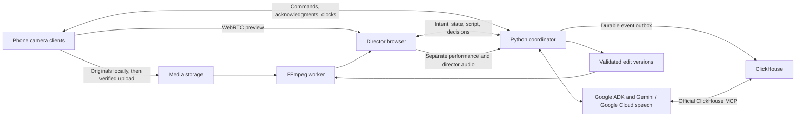

# Clappy implementation plan — historical version 1

Superseded by the root `IMPLEMENTATION_PLAN.md` on September 7, 2026. The user changed the demo to virtual iPhones and requested evaluation of existing open-source media infrastructure. Physical-device delivery gates and the original transport design below are historical, not current requirements.

Prepared September 7, 2026. Product source: [VISION.md](../../VISION.md).

## 1. The implementation decision

Build one complete production loop: **join cameras → load a scene → roll by voice → follow the performance → obey a live note → cut → replay → generate a different edit from the same originals.**

The first release targets three stationary phones, two performers, and a 60–90 second scripted scene. It must demonstrate real device control and a meaningful editorial decision that goes beyond cutting to whoever is speaking. A held reaction after a revealing line is the signature moment.

Use browser camera clients first, a React director surface, a Python coordinator, Google ADK/Gemini on Google Cloud, the official ClickHouse MCP server, and FFmpeg. Preserve a shared camera protocol so native clients can replace browser capture later.

This changes two starting hypotheses in the vision: defer React Native, and use React/Vite rather than Next.js for a predominantly realtime application that does not need server rendering. The reason is the available time and the need to prove simultaneous recording, preview, and audio early. Browser capture is a bounded first release, not a claim of native-camera quality or background reliability.

**Development authority:** the user reports direct organizer confirmation that Codex may be used for development; the restriction concerns the application's AI engine. Proceed with this Codex as the developer. Use only permitted Google Cloud AI in the submitted runtime. Do not reopen the development-tool question unless new direct evidence contradicts that clarification.

## 2. Starting conditions and delivery window

The workspace contains only `VISION.md` and is not yet a Git repository. There is no existing implementation to preserve beyond the vision.

Verified locally: Node/npm, pnpm, Python, uv, FFmpeg/ffprobe, gcloud, Docker CLI, and Git/GitHub CLI are present. Docker daemon availability and cloud permissions are unverified. Only Apple Command Line Tools are selected; full Xcode is absent from `/Applications`. Gemini CLI was not found on PATH or in the common installation locations checked. Install or locate it if useful; it is not a dependency of Clappy's runtime. An existing gcloud project is configured, but it is unrelated to Clappy and must not be assumed to be the deployment target.

The submission deadline is **September 9, 2026, 5 p.m. America/New_York**. The submission needs a hosted working app, public licensed source, a public demo video of at most three minutes, and runtime evidence of Google Cloud and the official `mcp-clickhouse` integration. Keep the judged deployment available through October 7. [Official rules](https://agentic-cinema.devpost.com/rules)

At planning time there are approximately 48 hours until submission. Budget roughly 36 hours of implementation and integration, keeping the remainder for failed spikes, the physical shoot, packaging, and submission. These are planning budgets, not a guarantee of uninterrupted execution or completion. No future background work is scheduled by this document.

## 3. Scope that protects the demo

| Ship in the first release | Defer until the complete loop works |
| --- | --- |
| Three cameras in a foreground mobile browser | Native camera apps, app-store distribution, background capture |
| Local original recording and verified upload | Guaranteed 4K, RAW, log profiles, professional timecode |
| QR pairing, camera roles, readiness, roll/cut acknowledgments | Arbitrary crew sizes and advanced permissions |
| One script entered as text or Fountain, editable character mapping | Scanned screenplay OCR and complex screenplay imports |
| Speaker/line following, shot duration rules, reaction holds | Arbitrary improvisation, voice biometrics, moving-camera tracking |
| Dedicated director voice input and manual controls | Perfect acoustic removal of spoken direction |
| Live program monitor plus recorded edit decisions | Frame-locked live broadcasting across heterogeneous phones |
| Synchronized playback, versioned alternate cut, MP4 and edit JSON | Full nonlinear editor, grading, effects, OTIO/NLE export |
| Real ClickHouse memory queries influencing edits | Large observability platforms and speculative multi-agent hierarchies |
| Browser simulator and a prepared judge walkthrough | General-purpose accounts, billing, collaboration SaaS |

Two real phones are the minimum physical proof; three remain the target. A laptop camera may support engineering tests but must not be presented as a third phone. No physical-device count is assumed verified yet.

## 4. Architecture



### Components and ownership

| Component | Responsibility | First implementation |
| --- | --- | --- |
| Camera client | Capture, local persistence, camera status, timestamps, uploads | React/TypeScript, MediaRecorder, IndexedDB, WebRTC |
| Director | Pairing, program monitor, script, notes, takes, edit comparison | React/Vite/TypeScript, CSS, Web Audio |
| Coordinator | Authoritative take state, command execution, synchronization, replayable events | FastAPI, asyncio, Pydantic, WebSockets |
| Agent | Interpret screenplay and intent; query memory; propose validated direction and edit changes | Python Google ADK and `google-genai`, Google Cloud credentials |
| Speech input | Director commands and performance transcript on separate channels | Gemini Live for director; Google Cloud streaming Speech-to-Text for performance |
| Production memory | Ordered production facts, shot history, coverage, take comparison | ClickHouse; official `mcp-clickhouse` for agent reads |
| Operational store | Command deduplication, session state, transactional outbox, render jobs | SQLite/WAL on persistent disk for one coordinator |
| Media worker | Inspect, synchronize, normalize derivatives, render | FFmpeg/ffprobe, NumPy/SciPy signal processing |
| Durable media | Original uploads, proxies, manifests, rendered versions | Google Cloud Storage; device copies retained |

**Initial deployment:** one Google Compute Engine VM with persistent disk, HTTPS reverse proxy, static web app, coordinator, a separate render worker process, and private MCP subprocess. Use ClickHouse Cloud if an account is available; a persistent self-hosted ClickHouse container is a supported alternative. Use an existing controllable domain for HTTPS, and verify DNS/certificate setup in the first milestone. Do not postpone the phone-accessible URL.

For three preview publishers and one subscriber, use direct WebRTC connections to the director. Signaling uses the existing WebSocket. Configure authenticated TURN for networks where direct connectivity fails; a small coturn service on the VM avoids adding an AI service. Never expose an anonymous relay. Test on the actual demo Wi-Fi.

The VM is intentionally a single-session/small-demo deployment. Do not run multiple coordinator processes against in-memory ownership. SQLite supplies durable control state; ClickHouse supplies analytical production memory. A future scale-out release can replace SQLite/session ownership with a shared transactional store. Cloud Run is an alternative once ownership and job persistence are externalized; its WebSocket timeout and best-effort affinity require explicit handling. [Cloud Run WebSockets](https://docs.cloud.google.com/run/docs/triggering/websockets)

### Recording and preview are independent

Acquire one camera stream per phone. Record the best stable supported format locally, aiming for 1080p/30 fps, while sending a lower-bitrate preview to the director. Capability-probe MIME types and actual track settings; do not assume H.264/MP4 across browsers. Lower preview quality before reducing original capture quality.

Persist ordered MediaRecorder chunks and a manifest in IndexedDB as they arrive. Keep sequence numbers, byte lengths, and checksums. Upload in the background only when bandwidth permits, and finalize by checking the complete object's hash and decoding it server-side. Offer explicit original download. Never delete local chunks automatically after upload.

MediaRecorder chunks are pieces of a recording and may not be independently playable. Reassemble the full ordered stream before inspection/transcoding. Chunk delivery intervals are not a media clock and may stall when mobile browsers pause or devices lock. The supported first-release condition is an unlocked, foreground camera page. Detect interruption, storage errors, and missing chunks; never label an incomplete file safe. Browser storage can be evicted, so visible export/upload confirmation is part of the workflow. [MediaRecorder timing](https://developer.mozilla.org/en-US/docs/Web/API/MediaRecorder/dataavailable_event), [format probing](https://developer.mozilla.org/en-US/docs/Web/API/MediaRecorder/isTypeSupported_static)

The director records each incoming preview stream as a separate local proxy during the take. These proxies enable fast post-take playback without waiting for full-resolution uploads. Preview-derived rough cuts are explicitly labeled; the original-file conform becomes a separate derived version once synchronization is validated.

## 5. The production protocol

### State machines

Camera state: `JOINED → PREPARING → READY → RECORDING → FINALIZING → RECORDED → UPLOADING → VERIFIED`. An interruption is a separate status with recoverable local assets, not a fabricated successful stop.

Take state: `DRAFT → ARMING → ARMED → STARTING → RECORDING → STOPPING → FINALIZING → READY`. Failure or partial coverage is recorded explicitly. A finalized take can have missing sources and still support an edit from the available coverage.

Every command includes `command_id`, `session_id`, `take_id`, `expected_state_version`, `kind`, `payload`, and expiry. Responses distinguish **accepted**, **applied**, and **failed**. Retries preserve the command ID; duplicate roll/cut requests cannot create additional recordings or takes. Late AI responses referencing an older take or state revision cannot execute.

### Roll and cut

1. The director selects required cameras and a maximum take length, default 90 seconds.
2. ARM checks permissions, storage, stream health, clock estimates, and local recording readiness.
3. ROLL commits a future start target, initially about 1.5 seconds ahead, after required cameras acknowledge preparation.
4. Each phone records its actual start observations and reports `RECORDING`. The coordinator shows confirmed, waiting, or failed per device.
5. No distributed atomic-start guarantee is claimed: a camera can fail after preparation. A partial start is visible and offers stop/retry or continuation with reduced coverage.
6. CUT stops reachable devices and waits for finalization. A phone with lost connectivity keeps recording to the agreed local limit or local stop; reconnection reconciles its result.

Manual roll, cut, and camera selection use exactly the same command path as voice. The director can always stop without waiting for an LLM. A phone also has a local stop button.

### Clock and media synchronization

Use monotonic clocks, repeated four-timestamp exchanges, low-round-trip samples, and an estimated uncertainty. Wall-clock timestamps are for audit display only. Store the relationship between each device clock and session time.

Network clock alignment schedules starts; it does not establish frame-accurate media synchronization. Recording callbacks, audio capture timestamps, received WebRTC frames, and encoded presentation timestamps have different origins.

Record a visible and audible clap at the start of each take. After stop, align each source to the selected master audio using waveform correlation, then verify with waveform peaks and visible frames. For longer takes, estimate drift with additional matching windows. Store a versioned mapping `session_time = offset + scale × source_media_time` and uncertainty. Do not alter original files.

Clock-only alignment is labeled approximate. Failed correlation produces a manual offset adjustment and a warning, not a false synchronized badge. The target for the controlled fixture is residual error within one output frame; real-phone performance must be measured and disclosed separately.

The live monitor prioritizes responsiveness. It is not guaranteed frame-aligned between cameras. Edit decisions retain their session timestamps and are conformed to verified source timestamps afterward. Changing a synchronization solution creates a new conform version; it does not rewrite the recorded live decision history.

## 6. Intelligence that can direct a scene

### Prepare the scene

Parse character cues and dialogue deterministically, then ask Gemini for a schema-validated scene interpretation: characters, ordered lines, beats, emotional transitions, coverage needs, and proposed directing policy. Let the director correct names, script structure, and camera assignments before arming.

Support three initial policies: balanced coverage, tension, and character emphasis. Translate each into concrete parameters: minimum shot duration, preferred opening, reaction preference, maximum time away from a character, and beat-specific holds. Default minimum shot duration is roughly 2.5 seconds, with explicit override for a director command.

### Follow the performance

Select one camera's production audio as the transcript/reference source. Forward its audio from the director browser to the backend as timestamped PCM blocks with sequence numbers and sample counts. Google Cloud streaming Speech-to-Text supplies incremental transcript data; associate it with the source audio timeline and preserve revisions. Its streaming interface uses gRPC on the backend. [Google streaming transcription](https://docs.cloud.google.com/speech-to-text/docs/streaming-recognize)

A bounded fuzzy alignment follows nearby script lines, tolerating repeats and small omissions. Character identity primarily comes from matched screenplay lines and camera assignment, not assumed acoustic identification. Unscripted lines and overlapping speech reduce confidence; they do not justify inventing a speaker.

Send meaningful beat transitions, new director notes, and ambiguous passages to Gemini. Use a deterministic shot scheduler between model responses. It applies current policy, camera health, minimum holds, and queued commands immediately. Gemini supplies editorial reasoning and policy updates, while ordinary code enforces temporal and media constraints.

Bound model concurrency, calls per take, and response age. Start with one outstanding reasoning call and coalesce newer observations. Never issue one expensive LLM request for every video frame. Sparse visual samples are a later enhancement if they measurably improve camera suitability.

### Director voice is a separate input

The director selects a headset microphone during setup. It feeds a separate Gemini Live session with production tools. Use the wake phrase for action requests, allow push-to-talk, and route spoken acknowledgments to the headset. Performance audio has no access to roll/cut tools.

Channel separation prevents actors' dialogue from becoming application commands. It cannot prevent a camera microphone from physically hearing a nearby director. For the demonstration, position the director out of earshot or speak quietly through a close headset microphone. No overlapping-speech removal promise.

Support these commands end to end: roll, cut, go wide, hold this shot, stay on Bella, go wide after Tom's next line, release hold, replay, and make Bella dominate another version. Model-specific Live transcription/function-call behavior and session resumption must be tested against the selected Google Cloud endpoint. Freeze tested model IDs in configuration rather than trusting a moving `latest` alias. [Gemini Live sessions](https://docs.cloud.google.com/gemini-enterprise-agent-platform/models/live-api/start-manage-session)

Conditional commands become explicit queued actions with a trigger, target, expiry, priority, and acknowledgment. “After Tom's next line” binds to the next qualifying line after command acceptance and executes on its completion. It expires at take end. If a trigger cannot be identified, show that uncertainty.

Priority: local/manual stop → direct director override → queued director condition → agent policy → safe camera fallback. A manual hold persists until released or its source fails. Low-confidence scene tracking holds a usable shot or selects the wide; it does not oscillate.

### Agent action contract

Expose a small tool surface: `prepare_scene`, `arm_take`, `start_take`, `stop_take`, `select_camera`, `set_hold`, `queue_direction`, `set_policy`, `create_edit_version`, `request_render`, and production-memory queries through MCP.

Every mutation is schema-validated and checked against current state and authorization. Script text and transcripts are content, never tool permissions. Store the input intent, returned proposal, accepted action, compact reason, model ID, and referenced events. Show a concise explanation such as “Holding Bella's reaction after the reveal,” with technical evidence available on demand.

## 7. ClickHouse is the agent's production memory

Use the official `mcp-clickhouse` process through ADK's MCP toolset. Discover the installed tool schema and integration-test it; do not assume a tool name from an older example. Keep MCP server-side with a read-only database role, constrained session views, result limits, and query timeouts. Write events through the coordinator's normal ingestion client. [Official server](https://github.com/ClickHouse/mcp-clickhouse), [ADK MCP integration](https://adk.dev/tools-custom/mcp-tools/)

### Data model

Start with an append-only `production_events` table and derived views. Each event carries an immutable ID, schema version, session/take/device IDs, device sequence, session sequence, occurrence and receipt times, event type, confidence, command/decision IDs, and a typed payload.

Important event families: camera assignments and health; command lifecycle; recording boundaries; clock samples and sync solutions; transcript revisions; script-line and beat positions; director instructions; committed switches; closed shot intervals; model/MCP calls; asset verification; and edit-version creation.

The coordinator stores event + operational change + outbox entry in one SQLite transaction. A background writer batches into ClickHouse with retries. Delivery is at least once; queries deduplicate by event ID explicitly rather than depending on background merges. Keep a per-session ingestion watermark and do not confuse arrival order with occurrence order.

Build views for latest camera assignments, available source intervals, transcript/beat history, per-character screen time, reaction coverage, instructions and their outcomes, and edit comparison. Open-shot duration uses an explicit current-time boundary; committed switches close intervals.

### Three required memory-dependent behaviors

1. **Live editorial context:** on a beat or note, Gemini queries camera roles, current shot, and recent coverage through MCP. It combines persisted history with a bounded pending-event tail, labeled with its watermark, to propose the next hold or switch.
2. **Take recall:** after restarting the agent, “What happened in this take?” is reconstructed from ClickHouse and references real commands and decisions.
3. **Alternate cut:** “Make Bella dominate” queries aligned source availability, previous shot allocation, beat history, and director notes through MCP before proposing a new edit. The result must materially differ while respecting valid coverage.

Record MCP request/result provenance and which evidence informed an edit. For an ablation check, disable ClickHouse: recording and manual safety controls continue, but memory-backed recall and alternate-cut generation become explicitly unavailable. This preserves footage while demonstrating that production intelligence actually depends on ClickHouse.

## 8. Editing and rendering

The internal edit format is versioned JSON with `edit_id`, `parent_edit_id`, `take_id`, `source_manifest_hash`, `sync_version`, `policy`, master audio selection, and ordered segments. Each segment identifies a camera, session in/out times, derived source in/out times, and a short reason/evidence reference.

Validate complete coverage of the chosen edit interval, no unintended gaps/overlaps, positive durations, existing sources, available source ranges, immutable source hashes, and a continuous audio bed. The first release does straight picture cuts against master audio; it does not switch audio microphones with every shot.

After CUT, close the final decision interval and expose the timeline immediately. Playback becomes available after local proxy finalization and alignment; display that processing status honestly. Render high-quality output asynchronously after originals are verified. Proxy-to-original replacement uses the same session timeline with a new conform revision.

FFmpeg normalizes derivatives for orientation, time base, resolution, frame rate, color metadata, and audio rate. Accurate arbitrary cuts require decode/re-encode, not blind stream copy at non-keyframes. Keep native originals untouched.

Alternate edits are immutable children of their parent. Compare versions at the same scene time and display useful evidence such as character screen-time share and reaction holds. If the requested emphasis is impossible because Bella has no usable coverage, explain the limitation and retain the original version.

Render jobs are persistent, idempotent, and retryable by edit/source/sync hash. Limit worker concurrency so rendering cannot interrupt a live take. Verify output duration, decodability, first/last frames, switch boundaries, and continuous audio. Initial exports: MP4, edit JSON, and a source manifest.

## 9. Product surfaces

**Setup:** scene text, inferred characters, three camera slots with QR join links, role selectors, small live previews, production/reference mic selection, and director headset selection. One clear readiness summary leads to Arm.

**Shoot:** program view dominates; camera strip shows role and tally; the script highlights the current line; one compact note shows the active instruction. The interface distinguishes preparing, recording, interrupted, and uploading. Manual CUT stays visible. Avoid filling the filmmaking surface with database or token details.

**Review:** take list, program player, compact camera timeline, originals status, voice/text redirection, and A/B versions. “Why this cut?” exposes decisions and ClickHouse evidence without making the user navigate an engineering dashboard.

**Phone:** assigned role, framing preview, large recording state, local storage/upload status, and emergency stop. Make permissions and the need to keep the page open explicit before arming.

Visual direction: quiet dark neutral surfaces, readable type, red only for recording, and stable camera colors reused across tally and timeline. Optimize desktop direction and landscape phone capture; test portrait setup as well.

## 10. Repository and interfaces

```text
apps/web/                 Director and camera routes, capture, WebRTC, playback
services/api/             FastAPI, sessions, commands, WebSocket hub
services/api/agent/       ADK agent, Google speech adapters, typed tools
services/api/memory/      Outbox, ClickHouse ingestion/views, MCP configuration
services/worker/          Media inspection, alignment, render job runner
packages/contracts/      Versioned schemas and generated TypeScript bindings
db/                      SQLite and ClickHouse migrations
tests/fixtures/          Small owned/generated synchronized media and scripts
tests/integration/       Protocol, media, agent and MCP acceptance scenarios
scripts/                 Environment checks, fixtures, local start, smoke tests
infra/                   Containers, VM/service configuration, deployment scripts
docs/                    Decisions, setup, evidence, runbook, demo script
```

Use Python/Pydantic schemas as the contract source and generate TypeScript types; lock dependency versions after the first working vertical slice.

Core HTTP boundaries: create session; pair device; save scene/roles; arm/start/stop take; post director intent; request/complete upload; read take/manifest; create/list edit versions; start/read render jobs. All mutation endpoints use idempotency keys. WebSocket messages cover clock exchange, status, commands/acknowledgments, WebRTC signaling, transcript/beat updates, and committed edit decisions.

Expose public judge access to owned sample sessions only. Camera pairing uses expiring tokens scoped to one session and role. The backend keeps cloud credentials and MCP private. Bound take duration, upload size, render concurrency, and AI usage for the public demo. Persist originals in private storage with scoped delivery URLs.

## 11. Build sequence and acceptance gates

Each milestone must leave a working slice and recorded evidence. Do not begin cosmetic polish while its underlying acceptance test is still failing. Time budgets are cumulative guidance; shorten optional scope as the deadline approaches.

| Milestone | Budget | Work and required proof |
| --- | --- | --- |
| M0: access and feasibility | 3 hours | Initialize Git and tooling; select Clappy cloud resources; verify Gemini/Live and one real MCP query; establish HTTPS; test record + preview + audio + finalized decode on an available phone. Record actual browser capabilities. |
| M1: coordinated capture | 5 hours | Pair three simulated clients, then available phones; arm/roll/cut with acknowledgments; local persistence and reconnect; upload/checksum; clerk-free remote start demonstrated. |
| M2: one complete manual take | 5 hours | Preview switching, proxy recording, event ledger, clap alignment, validated edit JSON and MP4. A manual 60-second multicamera take survives through replay before AI is added. |
| M3: the agent directs | 7 hours | Script interpretation, performance transcription/alignment, Gemini policy, dedicated voice tools, reaction holds and conditional note. Real MCP history influences at least one decision. |
| M4: redirect the same footage | 5 hours | Restart-safe take recall, MCP-backed alternate cut, source-preserving versions, A/B playback and render. Demonstrate increased Bella coverage using measured intervals. |
| M5: coherent product and failure recovery | 5 hours | Finish setup/shoot/review, judge walkthrough, real network interruptions, storage limits, stale model replies, deployed smoke test, and credential isolation. |
| M6: physical proof and submission package | 6 hours | Rehearse and film real devices; record the working app; assemble a sub-three-minute demo; complete README, license, attribution, architecture/evidence, and a reviewed submission draft. |

**Calendar targets:** September 7 proves capture and a manually edited take; September 8 connects voice, scene following, memory, and alternate edits; September 9 is for physical proof, reliability, and delivery. Aim for a feature freeze by 10 a.m. Eastern September 9 and a complete submission package by 2 p.m., leaving three hours for final corrections and submission.

### Explicit decision gates

- If a phone cannot record and stream reliably, first lower preview bitrate, then test 720p capture. Record all measured limitations. JPEG thumbnails may diagnose capture but do not satisfy the moving live-program demo.
- If one browser family fails, support the verified family and state the limitation. Native capture is only viable before the deadline if the SDK, signing, device access, and a working capture spike are already available. Do not spend the remaining window on speculative native setup.
- If physical devices are unavailable, finish the same protocol using simulators and a prepared replay session, but keep physical proof marked incomplete.
- If Gemini Live tool calls are unstable, retain the dedicated voice channel using Google transcription plus the ADK intent/tool pipeline. Voice functionality remains in scope even if the transport changes.
- If word timing is unreliable, use broader line boundaries and conservative holds. Measure latency; do not replace a claimed live feature with an undisclosed scripted demonstration.
- If ClickHouse Cloud setup stalls, run a persistent self-hosted cluster with the official MCP server. Do not substitute mocked memory for runtime evidence.
- If behind schedule, cut OCR, advanced camera controls, visual scene understanding, OTIO, elaborate UI animation, and secondary export types. Preserve real roll/cut, scene-aware switching, one live instruction, MCP-backed alternate edit, and source preservation.

## 12. Verification that matches the promises

Generate tiny deterministic three-camera fixtures with visible frame indices, shared audio clicks, known offsets/drift, scripted dialogue annotations, and deliberate dropouts. Use browser automation with injected media for routine UI/protocol checks. These tests do not replace physical mobile recording tests.

| Claim | Acceptance evidence |
| --- | --- |
| Devices record together | Applied acknowledgments and actual media alignment from repeated real roll/cut trials; show partial failure honestly |
| Footage survives network loss | Disconnect for 10 seconds; reconnect; verify original hashes and decode the complete take; no duplicated start |
| Synchronization is usable | Recover known fixture offsets within one output frame; measure clap/frame residual on real phones; flag uncertain alignments |
| Agent follows the scene | Replay skips/repeats and overlap; measure line tracking, latency, and erroneous switches; low confidence gives a stable fallback |
| Direction overrides automation | Test immediate hold, release, delayed wide, expired condition, duplicate tool call, and stale-take response |
| Performance is not the command channel | An actor saying “Clappy, cut” on performance input cannot stop a take |
| ClickHouse matters | Capture real MCP query/result traces; restart agent and reconstruct history; outage disables memory-dependent features |
| Alternate cuts preserve sources | Parent edit and original hashes remain unchanged; new intervals are valid; coverage and held reactions visibly differ |
| Render matches edit | Inspect frame-marked switch boundaries, total duration, rotation, audio continuity, and mixed input formats |
| Judges can use it | Open hosted URL in a fresh browser; complete the owned-sample walkthrough and make a live Gemini/MCP-backed alternate edit |

Performance targets for the controlled demo: manual command execution after validation under 250 ms on the test network; spoken command acknowledgment typically within 2 seconds; policy reaction after an accepted transcript/beat within 1 second excluding upstream transcription delay; locally finalized proxy review within 15 seconds of CUT. Instrument end-to-end p50/p95 and sample count. These are targets to validate, not advertised guarantees.

Track original transfer time separately: three 90-second streams at 8 Mbps are roughly 270 MB total before overhead. High-resolution availability depends on uplink bandwidth, which is why proxy review is a first-class requirement.

## 13. Demo and judging experience

Use an original two-person scene with a clear reveal and an identifiable silent reaction. Public AMI/Tears of Steel material can support later evaluation after file-level licensing checks; downloading large corpora is not on the deadline path. Do not make the final demonstration depend on rights-uncertain footage or generated actors.

Suggested video structure, with real waiting time represented honestly:

1. **0:00–0:20:** show three actual phones and the small-crew problem.
2. **0:20–0:45:** load the scene, identify camera roles, say “Clappy, roll,” and show device confirmations.
3. **0:45–1:25:** show the performance and autonomous cuts; issue “Stay on Bella after this,” and show the held reaction.
4. **1:25–1:50:** cut and replay the rough edit; show that originals remain available.
5. **1:50–2:25:** request Bella's version; show the memory-backed decision and a noticeably different A/B cut.
6. **2:25–2:50:** show concise runtime evidence and explain the value for a tiny crew.
7. **2:50–3:00:** finish with the working project and source links.

The hosted app includes a clearly labeled recorded sample for judges without phones. They can inspect the take, ask about production history, and create a fresh alternate version using real Gemini and ClickHouse calls. It is not described as live physical capture.

## 14. Execution ownership

This Codex owns implementation, dependency setup, fixtures, tests, browser verification, infrastructure scripts, debugging, media processing, documentation, and preparation of deployment/submission artifacts. Gemini CLI is optional development assistance; no CLI subprocess powers the production AI engine. Persist milestone status and evidence in `docs/BUILD_STATUS.md` during implementation so another turn can resume without rediscovery.

The user is needed only where the task requires their physical presence, identity, or a substantive external choice: make phones available, approve device permissions, position cameras, perform or arrange the scene, complete account/2FA flows where unavoidable, and confirm project/billing allocation if existing context does not identify it. Computer access cannot physically stage a shoot.

Plan now; do not provision paid resources or submit anything as a side effect of writing this document. During implementation, proceed through ordinary authorized work without recurring confirmations. Prepare concrete deployment and submission artifacts before any final approval that is actually required. Do not contact organizers or other people without explicit authorization.

**First implementation action:** build and test the single-camera HTTPS spike—local recording, preview, performance audio, and recoverable finalized file—while establishing real Google Cloud and ClickHouse MCP connectivity. That result determines the supported devices and removes the largest technical uncertainty before the rest of the product is built.
